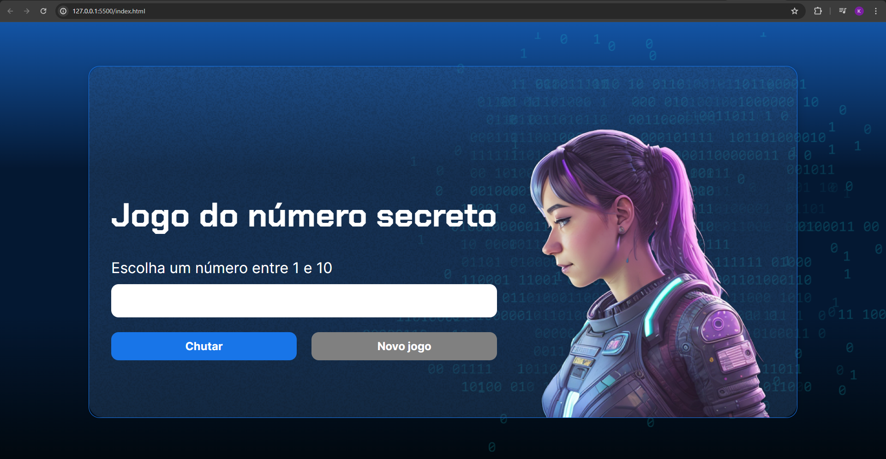

<h1 align="center">Jogo do Número Secreto</h1>

Link para o jogo: https://kari-jogo-numero-secreto.vercel.app/

  <a href="#-tecnologias">Tecnologias</a>&nbsp;&nbsp;&nbsp;|&nbsp;&nbsp;&nbsp;
  <a href="#-projeto">Projeto</a>&nbsp;&nbsp;&nbsp;

 

  

    
    </a>
  

 
 

 

## 🚀 Tecnologias

Esse projeto foi desenvolvido com as seguintes tecnologias:

<li> HTML
<li> CSS
<li> JavaScript
<li> GitHub
<li> Vercel

## 💻 Projeto

"JS Game - Alura" 

Um jogo para testar suas habilidades de adivinhação e estratégia. O objetivo é descobrir o número secreto escolhido dentro das tentativas até acertar e reiniciar um novo jogo. Você pode optar por usar ou não a tecnologia API de voz responsiva assim que entrar na página do jogo.
